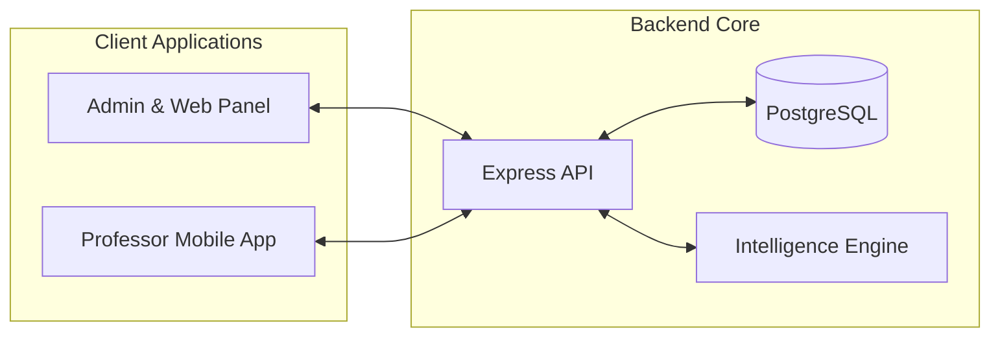

<div align="center">
  
  <h1 style="font-size: 3.5rem; font-weight: 900; margin-top: 10px; color: #00426B;">ITER ECOSYSTEM</h1>
  
  <p style="font-size: 1.2rem; color: #475569;">
    <strong>Scalable Monorepo Infrastructure for Advanced Educational Management</strong>
  </p>

  <div style="margin: 20px 0;">
    
    
    
    
  </div>

  <div style="font-weight: 600;">
    <a href="https://iter.kore29.com">Live Demo</a> • 
    <a href="./docs/index.md">Documentation Portal</a> • 
    <a href="./docs/guides/getting-started.md">Getting Started</a>
  </div>
</div>

---

## 🏛️ Project Architecture

Iter is a high-performance **Monorepo** designed to streamline the lifecycle of educational workshops, from scheduling and enrollment to real-time attendance and AI-assisted evaluations.



## 🚀 Key Capabilities

- **🧠 AI Scheduling**: Automated, fair distribution of students to workshops based on capacity and demand.
- **🎙️ NLP Evaluation**: Voice-to-text processing for real-time presence and competency assessment.
- **📄 Vision Validation**: Automated verification of signed pedagogical agreements using Computer Vision.
- **📊 Risk Analytics**: Early-warning system for student dropout prevention based on attendance patterns.

## 📁 System Structure

- **`apps/web`**: Consolidated **Next.js** application for Admin and Public interfaces.
- **`apps/api`**: Robust **Express** backend optimized with `tsx` and Prisma.
- **`apps/mobile`**: Multi-platform **Expo** application for field operations.
- **`packages/shared`**: Single source of truth for **Design Tokens**, Zod schemas, and Shared Types.

## 🛠️ Quick Start

Experience the full ecosystem in minutes using our automated Docker orchestration.

```bash
# Clone the repository
git clone https://github.com/iter-ecosystem/enginy.git

# Up the entire stack
docker compose up
```

> [!TIP]
> **New Developer?** Check out our [Getting Started Guide](./docs/guides/getting-started.md) for detailed environment configuration and the [OpenSpec Workflow](./docs/guides/openspec-workflow.md) to understand our AI-driven development cycle.

## 🌐 Infrastructure & Deployment

The ecosystem is optimized for **Production Reliability**:
- **Deployment**: Automated CI/CD via GitHub Self-Hosted Runners.
- **Proxy**: Global Nginx management for secure SSL termination.
- **Containerization**: Multi-stage Docker builds for minimal footprint.

---
<div align="center">
  © 2026 Consortium of Education of Barcelona. Project Enginy.
</div>
