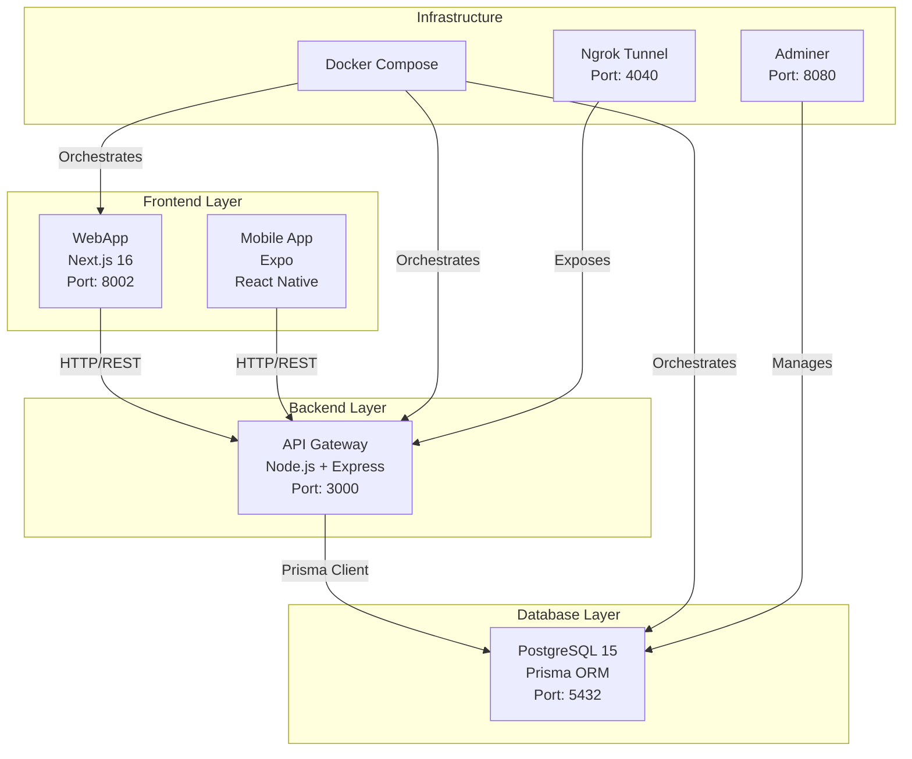
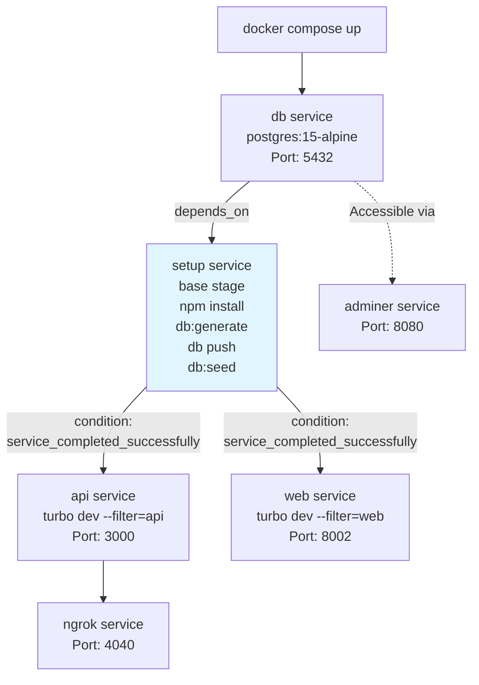
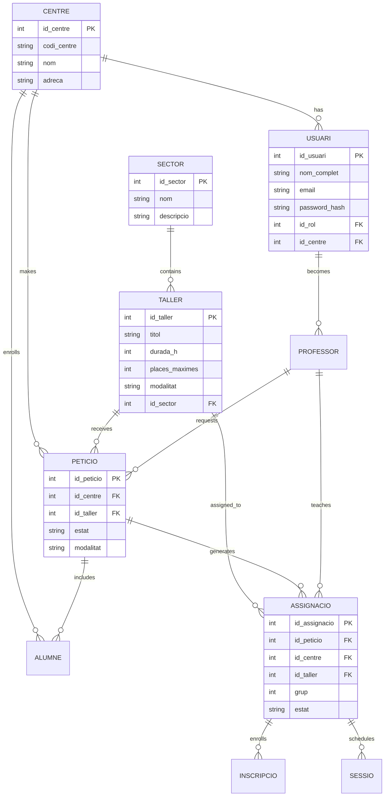
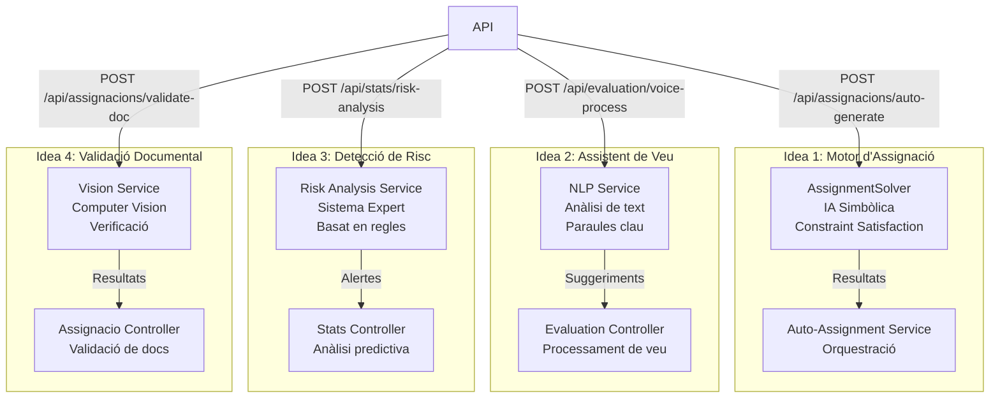
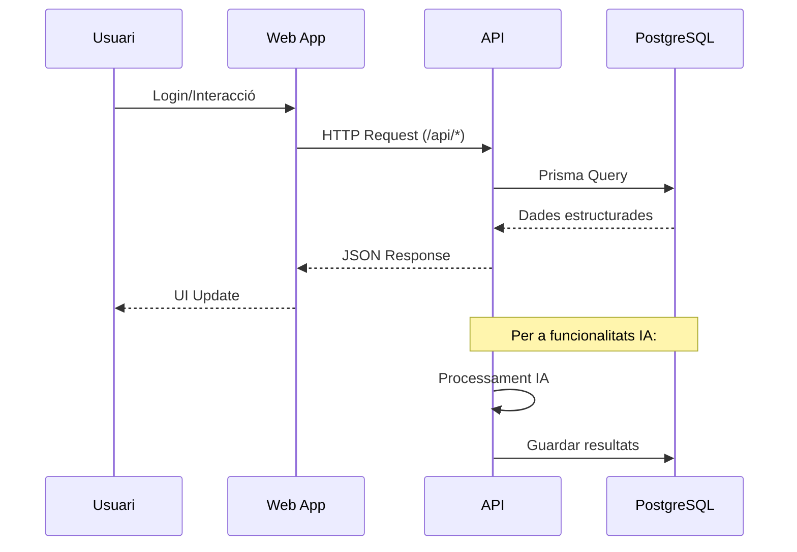
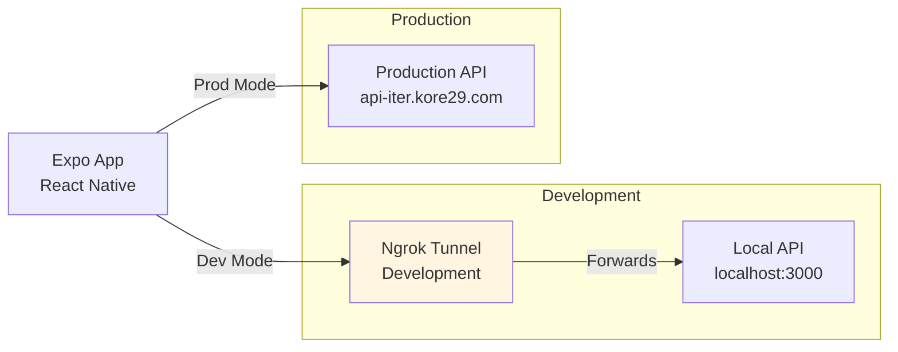
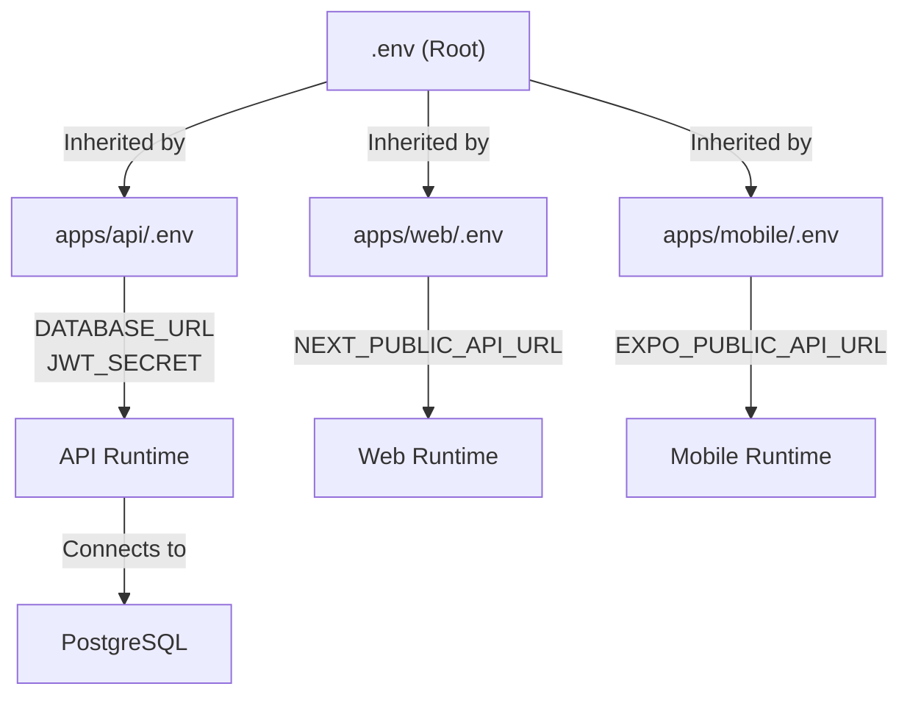

# Diagrames del Sistema ITER ECOSYSTEM

## 🏗️ Arquitectura General del Sistema

## 🐳 Flux de Docker Compose

## 🗄️ Esquema de Base de Dades Principal

## 🤖 Flux de Funcionalitats d'IA

## 🔄 Flux de Dades Complet

## 📱 Arquitectura Mobile

## 🔧 Configuració d'Entorn

---

## Notes

- **Arquitectura Monorepo**: El projecte utilitza Turborepo per gestionar múltiples aplicacions en un sol repositori.
- **Base de Dades**: PostgreSQL per a dades estructurades amb Prisma ORM.
- **Orquestració Docker**: Flux seqüencial amb servei setup dedicat per evitar conflictes.
- **Funcionalitats IA**: Quatre mòduls integrats amb diferents enfocaments (simbòlic, NLP, expert system, computer vision).
- **Esquema de Dades**: Model relacional complex amb entitats principals com Centre, Usuari, Taller, Peticio, Assignacio.
