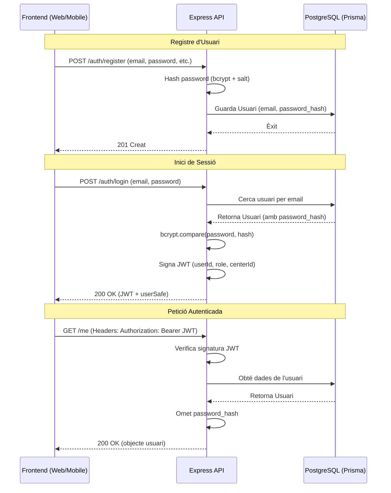

# 🛡️ Architecture de Seguretat i Flux de Dades

Aquest document detalla els mecanismes de seguretat i el flux de dades sensibles dins de l'ecosistema **Iter**.

## 1. Flux de Seguretat d'Alt Nivell

## 2. Gestió de Dades Sensibles

### 🔑 Contrasenyes
- **Hashing**: Utilitzem `bcrypt` amb un factor de salt de `10`.
- **Emmagatzematge**: Només es guarda el `password_hash` a la taula `usuaris`.
- **Prevenció de Fugues**: El controlador d'autenticació omet explícitament el hash abans d'enviar les dades al client.

### 🎫 Gestió de Sessions (JWT)
- **Signatura**: Els JWT es signen amb una `JWT_SECRET` (mínim 10 caràcters, validat per Zod).
- **Contingut**: Inclou identificadors essencials no sensibles (`userId`, `role`, `centerId`).
- **Expiració**: Configurada actualment a `24h`.
- **Emmagatzematge**:
    - **Web**: `localStorage`.
    - **Mòbil**: `expo-secure-store` (emmagatzematge encriptat per maquinari).

### 🏷️ Dades de l'Alumnat (PII)
- **Identificadors**: Els alumnes s'identifiquen mitjançant un `idalu` únic.
- **Control d'Accés**: Les consultes es filtren per centre o usuari per garantir l'aïllament de dades.

## 3. Infraestructura i Encapsulament

### Validació d'Entorn
L'API utilitza **Zod** per validar les variables d'entorn a l'arrancada, garantint que els secrets necessaris estiguin presents i siguin segurs.

### Gestió d'Errors i Registres
- **Sense Fugues**: L'error handler assegura que els *stack traces* només s'enviïn en mode desenvolupament.
- **Logs Segurs**: Winston està configurat per a sortida JSON, ideal per a agregadors de logs segurs.

## 4. Millores Planificades

Per a la maduresa del projecte, s'han identificat les següents millores:
1.  **Cookies HTTP-Only**: Migrar de `localStorage` a cookies segures per mitigar riscos XSS en web.
2.  **Rate Limiting**: Implementar límits de velocitat per prevenir atacs de força bruta.
3.  **Encriptació en Repòs**: Considerar encriptació a nivell de camp per a PII sensible a la base de dades.
