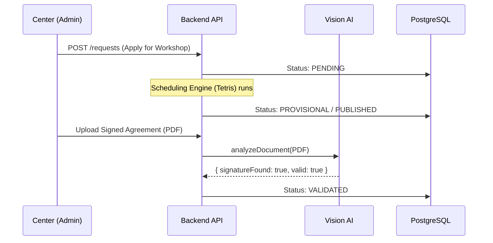
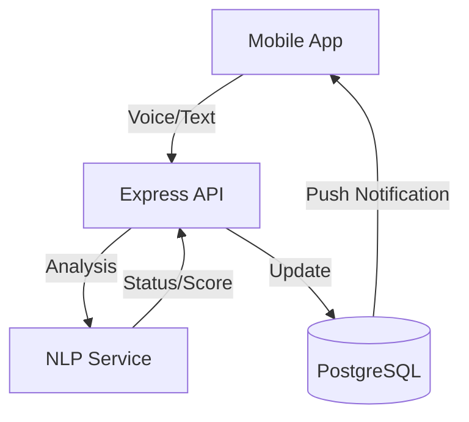
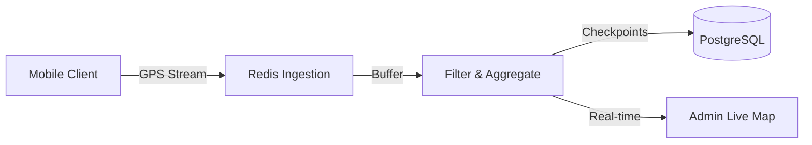

# Architecture: Data Flow & Lifecycles

Understanding how data moves through the Iter Ecosystem is crucial for maintaining integrity and performance.

## 1. The Enrollment Lifecycle

This diagram illustrates the journey from a center's request to a validated student enrollment.

## 2. Real-Time Feedback & Attendance

The interaction between the professor's mobile app and the AI services.

## 3. High-Frequency Telemetry (Proposed)

Architecture for real-time location tracking during field field activities.

---

*For technical details on these components, refer to the [System Overview](./system-overview.md).*
