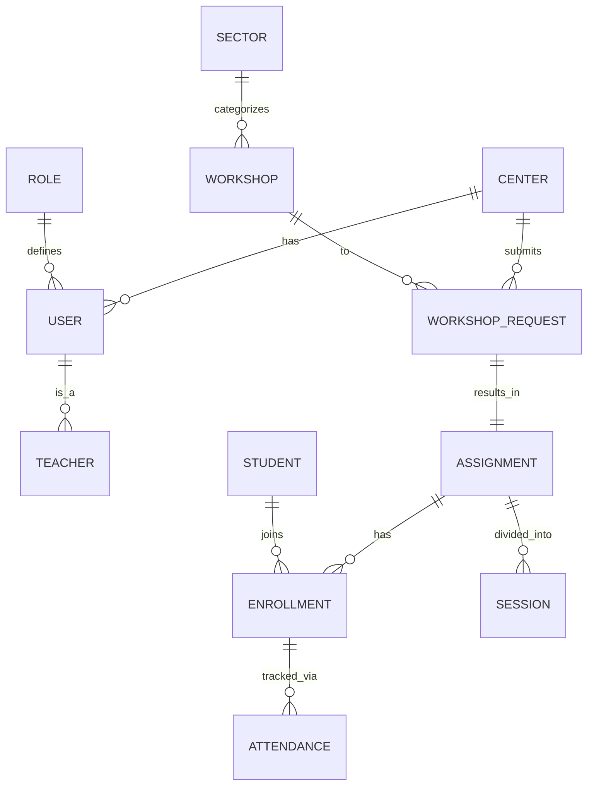

# Data Model

The **Iter Ecosystem** uses a Relational Database (Postgres) managed via **Prisma ORM**. The schema is divided into logical modules to handle institutional identity, operational logistics, and educational tracking.

## 🗺️ Entity Relationship Map

## 📦 Core Modules

### 1. Identity & Structure
- **Center**: Educational institutions (Schools/Institutes). Identified by a unique `centerCode`.
- **User**: Authentication entity. Can be an `ADMIN`, `COORDINATOR`, or `TEACHER`.
- **Role**: Defines platform-wide permissions.
- **Teacher**: A specialized user profile linked to a specific center.

### 2. Workshop Catalog
- **Sector**: High-level categories (e.g., Digital Transformation, Artistic Creation).
- **Workshop**: Specific training modules with a defined title, duration, and modality (A, B, or C).

### 3. Operations (Logistics)
- **Request**: A center's application for a workshop. Moves through `PENDING`, `APPROVED`, or `REJECTED`.
- **Assignment**: The finalized execution of a workshop. Linked to dates, teachers, and centers.
- **Session**: Specific calendar slots within an assignment (dates and times).

### 4. Tracking & Quality
- **Student**: Individuals participating in the ecosystem.
- **Enrollment**: Links a student to a specific assignment.
- **Attendance**: Daily tracking of student presence per session.
- **Evaluation**: Feedback and competence assessments gathered at the end of a workshop.

## ⚙️ Prisma Usage

We use Prisma's strict typing system. The schema is located at `apps/api/prisma/schema.prisma`.

### Key Enums
- **Modality**: `A`, `B`, `C` (defines the type of instructional delivery).
- **AssignmentStatus**: `PUBLISHED`, `IN_PROGRESS`, `COMPLETED`, etc.
- **AttendanceStatus**: `PRESENT`, `ABSENT`, `LATE`, `JUSTIFIED_ABSENCE`.

---

> [!TIP]
> To visualize the schema in your browser, you can run `npx prisma studio` in the `apps/api` directory, or access the local Adminer at [http://localhost:8080](http://localhost:8080).
