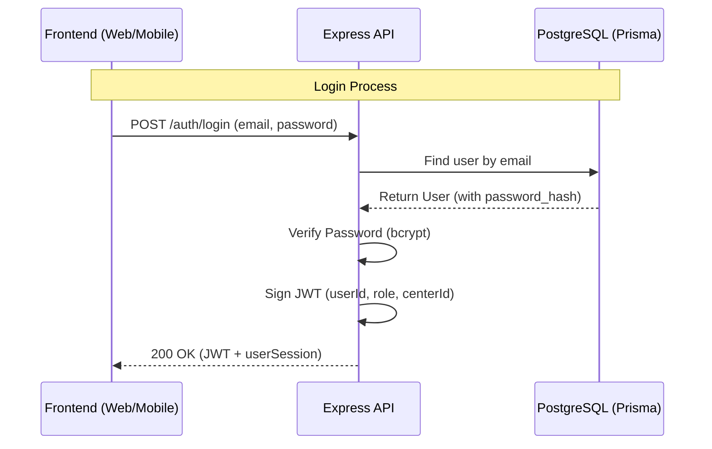

# Security Architecture & Data Flow

This document details the internal security mechanisms and sensitive data handling processes.

## 1. Authentication Flow

## 2. Sensitive Data Handling

- **Passwords**: Hashed with `bcrypt` (10 rounds).
- **JWT**: Signed tokens managed via `JWT_SECRET`.
- **Data Isolation**: Multi-tenant filtering by `centerId` to protect student PII.

---
*For the reporting policy, see the root [SECURITY.md](../../SECURITY.md).*
