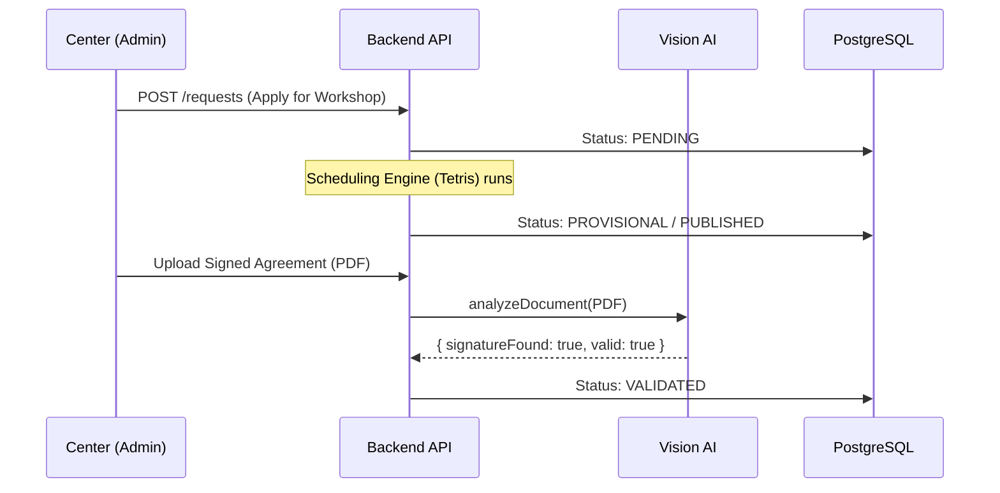
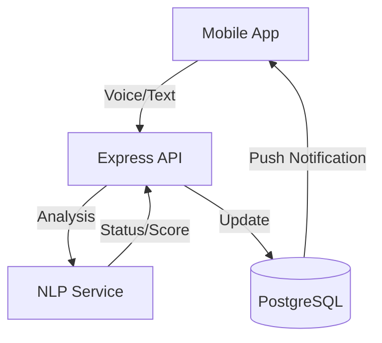

# System Overview

The **Iter Ecosystem** is a modern, full-stack platform built with a monorepo architecture. It connects educational centers, coordinators, and teachers through a unified data layer and specialized client applications.

## 🛠️ Technology Stack

| Layer | Technology |
| :--- | :--- |
| **Monorepo** | [Turborepo](https://turbo.build/) + NPM Workspaces |
| **Backend** | [Node.js](https://nodejs.org/) + [Express](https://expressjs.com/) |
| **Frontend** | [Next.js 15](https://nextjs.org/) (App Router) |
| **Mobile** | [React Native](https://reactnative.dev/) + [Expo](https://expo.dev/) |
| **Database** | [PostgreSQL](https://www.postgresql.org/) + [Prisma ORM](https://www.prisma.io/) |
| **Language** | [TypeScript](https://www.typescriptlang.org/) (Strict Mode) |

## 📁 Directory Structure

```text
.
├── apps/
│   ├── api/          # Express Backend (Business logic, DB interaction)
│   ├── web/          # Next.js Frontend (Institutional & Dashboard)
│   └── mobile/       # React Native / Expo App (Teacher field work)
├── shared/           # Common types, roles, and schema-based constants
├── docs/             # This documentation suite
├── openspec/         # AI-driven feature specifications (OPSX)
└── docker-compose.yml# Local infrastructure orchestration
```

## 🏗️ High-Level Architecture

### Core Data Flows

#### 1. Workshop Enrollment Lifecycle
The journey from a center's request to a validated student enrollment.



#### 2. Real-Time Feedback & Attendance
Interaction between the professor's mobile app and AI services.



## 🧱 Service Responsibilities

1.  **Core API**: The `api` service handles all authentication, data validation, and business logic. It exposes a RESTful interface.
2.  **Shared Package**: The `shared` package is a key component that exports TypeScript interfaces and constants (like `ROLES` or `PHASES`) used by both the API and the Web/Mobile clients.
3.  **Client Applications**:
    - **Web**: Focused on administrative tasks (Coordinators and Admins).
    - **Mobile**: Focused on operational tasks (Teachers marking attendance).

---

> [!NOTE]
> For detailed information on the database structure, refer to the **[Data Model](./data-model.md)** guide.
