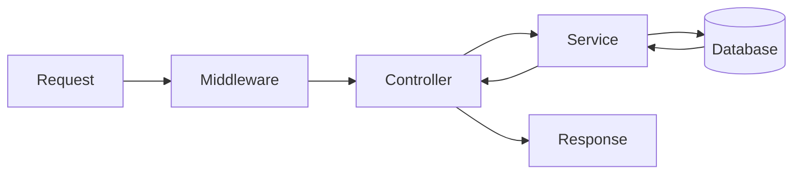

# Developer Guide: API Patterns & Standards

To maintain a scalable and clean backend, all contributors must follow these architectural patterns when developing the **Iter API**.

## 1. Controller-Service Middleware Pattern

We follow a strict separation of concerns:

- **Routes**: Define endpoints and apply middleware.
- **Controllers**: Handle HTTP-specific logic (params, query, responses).
- **Services**: Contain the core business logic and database interactions.
- **Middlewares**: Enforce security, validation, and logging.



## 2. Authentication & RBAC

All endpoints must be protected using `authenticateToken` unless they are explicitly public (like `/login`).

### Role-Based Access
Use specialized middlewares to restrict access by role:
- `isAdmin`: Full access to global configuration.
- `isCoordinator`: Access to center-specific data.
- `isTeacher`: Access to assigned sessions and students.

## 3. Data Validation (Zod)

Never trust client input. Use **Zod schemas** from `@iter/shared` to validate request bodies.

```typescript
// Example Controller Implementation
import { studentSchema } from '@iter/shared';

export const createStudent = async (req, res) => {
    const validatedData = studentSchema.parse(req.body);
    const result = await studentService.create(validatedData);
    res.status(201).json(result);
};
```

## 4. Error Handling

- **Internal Errors**: Use `try/catch` and return a structured JSON error response with status `500`.
- **Validation Errors**: Return status `400` with descriptive error messages.
- **NOT FOUND**: Return status `404` when a resource (e.g., Enrollment) does not exist.

## 5. Prisma Best Practices

- Always use the shared Prisma client in `lib/prisma.ts`.
- Use `include` sparingly to avoid over-fetching.
- For complex filters, define named query objects if they are reused.

---

*For detailed entity relations, refer to the [Database Schema](../../openspec/specs/database/schema.md).*
