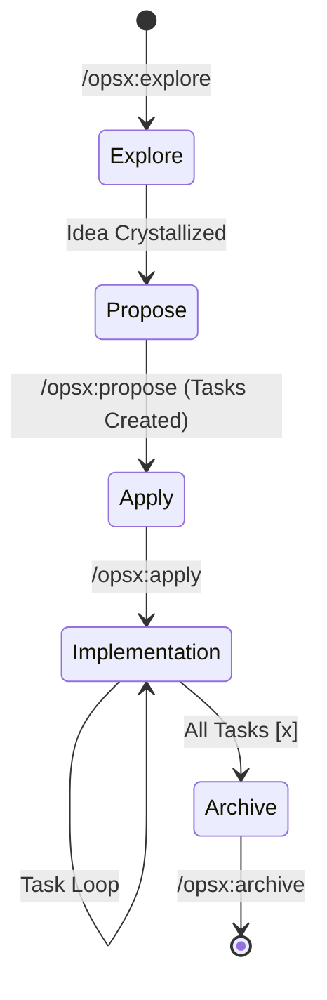

# Developer Guide: Working with OpenSpec & AI

This guide outlines the professional workflow for developing the Iter Ecosystem using **OpenSpec**, our AI-driven specification framework.

## 1. The Core Concept

OpenSpec ensures that **code follows the specification, and the specification reflects the code.**

## 2. The OPSX Lifecycle

We use a 4-phase cycle to manage all changes safely and predictably.

### Phase 1: Exploration (`/opsx:explore`)
- **Thinking Partner**: Analyze the codebase and existing specs.
- **Outcome**: A solid technical direction.

### Phase 2: Proposal (`/opsx:propose`)
- **Change Management**: Automatically creates a dedicated change directory.
- **Artifacts**: `proposal.md`, `design.md`, `tasks.md`.

### Phase 3: Implementation (`/opsx:apply`)
- **Execution**: The AI works through the task checklist.
- **Verification**: Immediate feedback on code changes.

### Phase 4: Archival (`/opsx:archive`)
- **Knowledge Synchronization**: Updates global specs and archives the change.

## 3. Best Practices

- **Spec-First**: Change requirements in the spec before writing code.
- **Review Design First**: Fix architectural flaws in `design.md` before they become bugs.
- **Granular Apply**: Let the AI handle one task at a time for maximum reliability.

---

*Refer to the [Getting Started](./getting-started.md) guide for local environment setup.*
