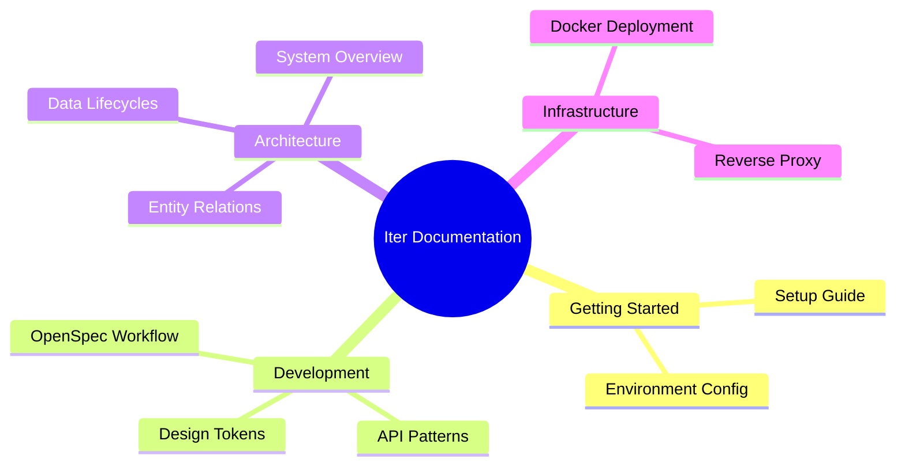

# Documentation Portal

Welcome to the professional documentation suite for the **Iter Ecosystem**. This portal is designed to provide clear, actionable guidance for developers, architects, and stakeholders.

## 🗺️ Navigation Map

## 🚀 Guides for Developers

- **[Getting Started](./guides/getting-started.md)**: Your first 15 minutes with the project.
- **[OpenSpec Workflow (OPSX)](./guides/openspec-workflow.md)**: How to build features using our AI-driven specification framework.
- **[API Patterns](./guides/api-patterns.md)**: Coding standards for our Node.js/Express backend.

## 🏗️ Technical Architecture

Detailed insights into how the system is built and how it scales.

- **[System Overview](./architecture/system-overview.md)**: High-level technological stack and directory structure.
- **[Data Lifecycle & Flows](./architecture/data-flow.md)**: Sequential diagrams of key business processes.
- **[Database Schema](../openspec/specs/database/schema.md)**: Human-readable translation of the Prisma data model.

## 🧩 Capability Specifications

Explore the core logic behind our business features:

| Capability | Focus | Specification |
| :--- | :--- | :--- |
| **Scheduling** | AI Auto-Assignment | [View Spec](../openspec/specs/capabilities/scheduling.md) |
| **Validation** | Vision AI & Compliance | [View Spec](../openspec/specs/capabilities/validation.md) |
| **Attendance** | NLP & Telemetry | [View Spec](../openspec/specs/capabilities/attendance-telemetry.md) |
| **Evaluations** | Competencies & Feedback | [View Spec](../openspec/specs/capabilities/evaluations.md) |

---

> [!IMPORTANT]
> **Professional Tone Policy**: All documentation must maintain a technical, active-voice, and professional tone. Avoid generic descriptions and focus on implementation details.
