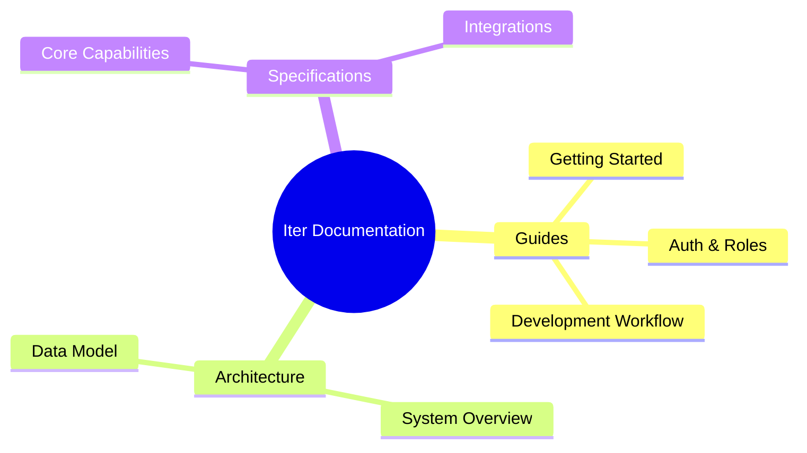

# Documentation Portal

Welcome to the professional documentation suite for the **Iter Ecosystem**. This portal provides clear, actionable guidance for developers, architects, and stakeholders.

## 🗺️ Navigation Map

## 🚀 Developer Guides

Procedural documentation for onboarding and day-to-day operations.

- **[Getting Started](./guides/getting-started.md)**: Installation, environment setup, and Docker configuration.
- **[Auth & Roles](./guides/auth-and-roles.md)**: Understanding RBAC and seed login examples.
- **[Development Workflow](./guides/development.md)**: Coding standards, branch naming, and Turbo commands.

## 🏗️ Technical Architecture

Detailed technical references for the system's design and structure.

- **[System Overview](./architecture/system-overview.md)**: Tech stack, service map, and directory structure.
- **[Data Model](./architecture/data-model.md)**: Database schema and entity relationships.

## 🧩 Capability Specifications

Explore the core logic behind our business features:

- **[Functional Specs](../openspec/specs/)**: Detailed requirements for individual capabilities.

---

> [!NOTE]
> All documentation maintains a professional English standard to ensure international accessibility.
