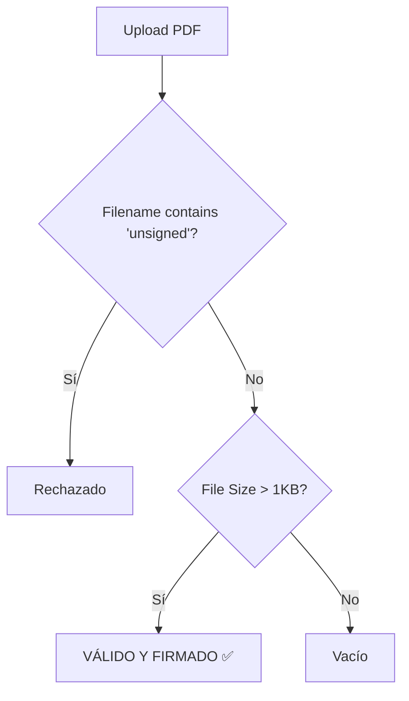

# 🔍 Informe de Auditoría: Motores de IA (Proyecto Iter)
**Fecha:** 7 de Abril, 2026  
**Auditoría Interna:** Evaluación de Incoherencias y Errores Lógicos en Servicios de Inteligencia Artificial.

---

## 🚩 Hallazgos Críticos

### 1. El "AI-Washing" (Incoherencia Conceptual)
El proyecto se presenta externamente como una plataforma impulsada por IA (NLP, Computer Vision, Scheduling Inteligente). Sin embargo, la implementación técnica actual consiste exclusivamente en **heurísticas de texto (`if/else`) y lógica determinista**. No existen modelos de redes neuronales, transformadores (LLMs) ni OCR integrados.

> [!CAUTION]
> **Riesgo:** Si un cliente o auditor espera validaciones basadas en aprendizaje profundo, el sistema actual fallará en casos moderadamente complejos (ej. texto no estructurado o imágenes con ruido).

---

### 2. Los "Falsos Positivos" de Firma (`VisionService`)
El servicio `VisionService` tiene una lógica de validación invertida que supone un riesgo de seguridad en la integridad documental.

**Fallo Detectado:**  
Cualquier documento PDF de más de 1KB que no contenga la palabra inglesa "unsigned" en su nombre se considera **válido y firmado**. Un documento en catalán llamado `no_firmat.pdf` o un PDF con páginas en blanco pero con metadatos pesados pasaría la validación como "Correcto".

---

### 3. El Problema del Catalán (`NLPService`)
El parser de lenguaje natural tiene errores gramaticales que discriminan el uso correcto del catalán.

| Regla | Palabra Clave | Resultado | Fallo |
| :--- | :--- | :--- | :--- |
| **Justificación** | `justificad` | `JUSTIFIED_ABSENCE` | **Ignora** el catalán `justificat` (termina en 't'). |
| **Puntualidad** | `puntual`, `tarde` | `LATE` / `PRESENT` | No detecta variaciones como `retard`. |
| **Faltas** | `falta`, `absent` | `ABSENT` | No detecta `no ha vingut`. |

**Consecuencia:** El sistema de evaluación automática penalizará o ignorará feedback escrito en catalán gramaticalmente correcto si no coincide con las raíces españolas forzadas en el código.

---

### 4. Sesgo de Ponderación (`RiskAnalysisService`)
El cálculo de riesgo de abandono escolar utiliza pesos arbitrarios no normalizados:

*   **Puntuación:** `riskScore += (lowEvaluations * 10)`
*   **Problema:** Si un alumno tiene 10 evaluaciones con nota `< 3` (aunque sean de una sola semana o de bajo peso), su riesgo llega al 100% (Crítico), ignorando un historial de asistencia perfecto. El sistema no pondera la importancia de la competencia evaluada.

---

## 🚀 Recomendaciones de Mejora

1.  **Migración a LLMs (Gemini/OpenAI):** Sustituir los parsers de `NLPService` por una llamada a una API de lenguaje real para soportar multi-idioma (ES/CA/EN) de forma natural.
2.  **Integración de OCR (Vision):** Implementar **AWS Textract** o **Google Cloud Vision** en `VisionService` para detectar realmente la presencia de firmas en los campos correspondientes.
3.  **Modelo de Riesgo Dinámico:** Ajustar `RiskAnalysisService` para usar una media ponderada en lugar de una suma acumulativa lineal.
4.  **Sincronización Transversal:** Asegurar que si el parser de NLP detecta una "Falta", se sincronice automáticamente con el `RiskAnalysisService` de forma transaccional.

---
*© 2026 Equipo de Ingeniería - Iter Ecosystem*
