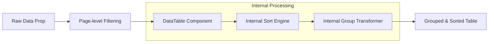

# Design: Advanced Grid Interactions

## Architecture Overview
The sorting and grouping functionality will be implemented as **internal middleware** within the `DataTable` component. This ensures that any page using the component gets the features for free without needing to implement complex state in every individual page.

## Data Flow

## Component Updates

### 1. `DataTable.tsx` Refactor
- **State**:
    - `sortConfig`: `{ key: string | null, direction: 'asc' | 'desc' | null }`.
    - `groupBy`: `string | null` (referenced by column header/accessor).
    - `collapsedGroups`: `Set<string>` (persisted in memory during session).
- **Core Logic**:
    - `sortedData`: `useMemo` that handles comparison for multiple types (String, Number, Date).
    - `groupedData`: `useMemo` that transforms `sortedData` into `Map<string, T[]>` if `groupBy` is set.
- **UI Elements**:
    - **Sort Indicators**: `lucide-react` icons (ChevronUp, ChevronDown) appearing on hover and when active.
    - **Group Headers**: Custom `<tr>` with a single `<td>` spanning all columns. Style: Sticky, background-subtle, bold text.

### 2. `DataTableToolbar.tsx` Refactor
- **Props**: Add `groupByOptions: { label: string, value: string }[]`.
- **UI**: Added a "Columna per agrupar" selector using the existing `FilterSelect` layout to maintain 1px border consistency.

## State Persistence
- `sortConfig` and `groupBy` could be persisted to `localStorage` (like column widths) using the `tableId` as a key, but for now, we will keep them as component-local state to avoid unexpected behavior on page reload.
