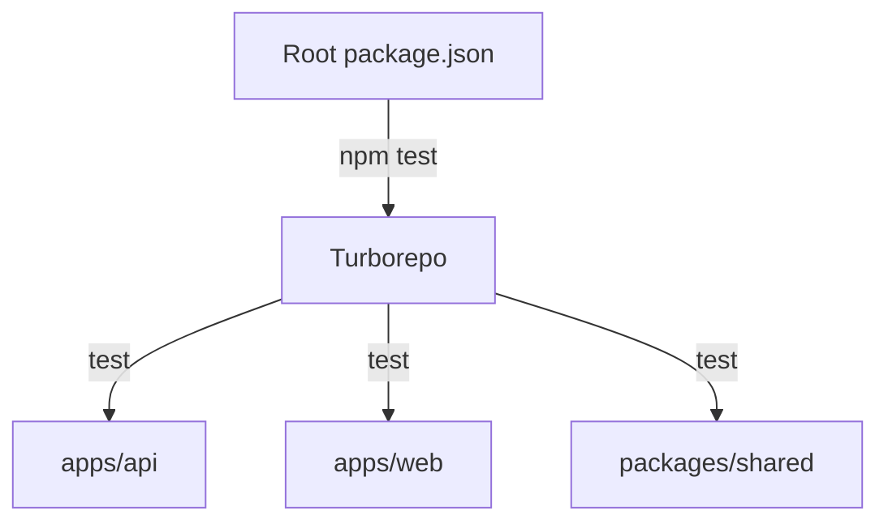
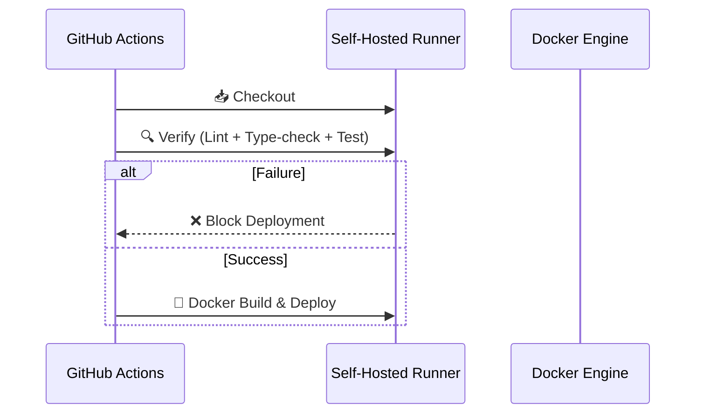

# Design: Testing Infrastructure

## Context

The Iter Ecosystem is a mature monorepo with complex business logic (AI scheduling, NLP, Vision) but lacks any automated testing framework. This creates a high risk for regressions during refactoring or feature additions. Currently, the deployment pipeline is "blind" to logical errors.

## Goals / Non-Goals

**Goals:**
- Implement a **monorepo-wide testing strategy** using Turborepo.
- Adopt **Vitest** for its speed, ESM compatibility, and developer experience.
- Integrate **automated quality gates** (Lint, Type-check, Test) into the CI/CD pipeline.
- Coverage of critical services: `AutoAssignmentService`, `NLPService`, and `@iter/shared` logic.

**Non-Goals:**
- Achieving 100% test coverage in the first phase.
- Implementing complex E2E tests (Cypress/Playwright) for the web/mobile UIs (focus is on the logic layer first).
- Setting up a full staging environment (deployment remains on the self-hosted production runner).

## Decisions

### 1. Unified Test Runner: Vitest
We will use Vitest across all packages. It is significantly faster than Jest and handles the monorepo's TypeScript/ESM structure natively without complex Babel configurations.

### 2. CI/CD Pipeline Overhaul
The `deploy-self-hosted.yml` will be restructured to follow a "Verify -> Build -> Deploy" pattern.

### 3. Database Testing Strategy
For `apps/api`, we will use a separate PostgreSQL instance (or a specific test schema) to avoid polluting production/dev data during integration tests.

## Risks / Trade-offs

- **Risk**: Database synchronization in CI. 
- **Mitigation**: Use `prisma db push` in a dedicated test container if possible, or mock the database layer for pure unit tests.
- **Trade-off**: Adding testing to CI will increase deployment time, but the gain in reliability outweighs the cost.
