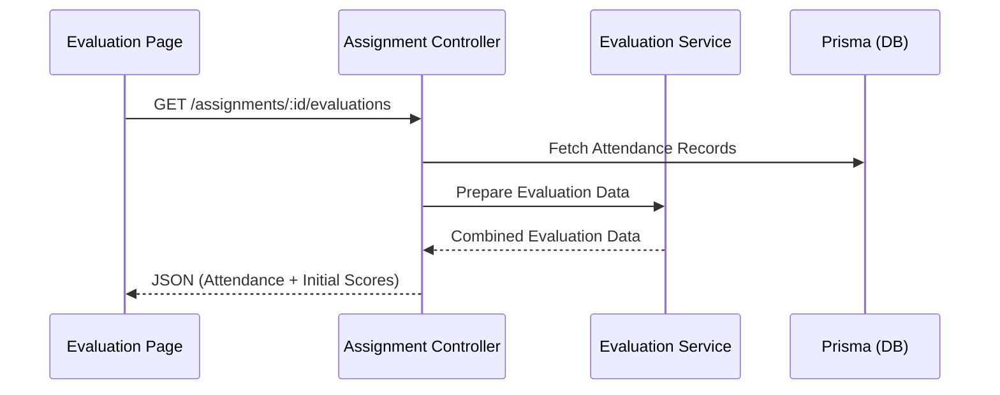

# Diseño: Finalización de las Fases 3 y 4

## Arquitectura de Integración

### 1. Flujo de Datos para Evaluación (Backend)
Al solicitar la evaluación de un grupo (`Assignment`), el sistema debe:
- Recuperar todos los alumnos matriculados (`Enrollment`).
- Calcular el porcentaje de asistencia desde los registros de `Attendance`.
- Inicializar la matriz de evaluación en `EvaluationService`.

### 2. Cierre y Certificación
El cierre de un taller es el disparador para la generación de certificados.
- **Acción:** `POST /assignments/:id/close`
- **Lógica:**
  1. Validar que todas las sesiones tengan asistencia registrada.
  2. Validar que todos los alumnos tengan evaluación completada.
  3. Cambiar estado del `Assignment` a `CLOSED`.
  4. Llamar a `CertificateController.generateCertificates`.

### 3. Interfaz de Usuario (Frontend)
- **Página de Evaluación:** Una tabla editable que combina datos de asistencia (lectura) con selectores de competencia (escritura).
- **Asistente AI:** Un botón de micrófono para activar el `NLPService` y rellenar automáticamente las observaciones y sugerir puntuaciones.

## Consideraciones Técnicas
- **Consistencia de Nombres:** Utilizar nombres en inglés `CamelCase` según el refactor reciente (ej: `assignmentId` en lugar de `id_asignacio`).
- **Seguridad:** El cierre solo puede ser realizado por coordinadores o administradores.
