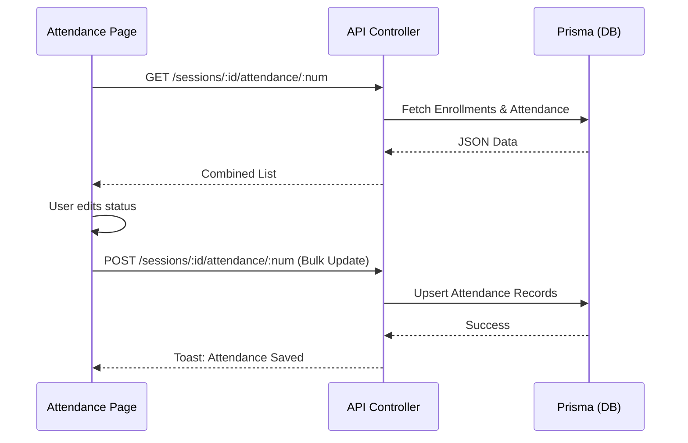

# Diseño: Sistema de Registro de Asistencia

## Arquitectura del Backend

### Endpoints
Se implementarán los siguientes métodos en `apps/api/src/controllers/assignment.controller.ts`:

1.  **`getSessionAttendance` (GET):**
    - Obtiene la lista de alumnos matriculados (`Enrollment`) para el `assignmentId` dado.
    - Recupera o inicializa los registros de `Attendance` para el `sessionNum` específico.
    - Devuelve una lista combinada de alumnos con su estado de asistencia actual.

2.  **`registerAttendance` (POST):**
    - Recibe un array de objetos `{ enrollmentId, status, observations }`.
    - Realiza una actualización masiva (upsert) en la tabla `Attendance`.
    - Valida que la sesión pertenezca al rango de fechas permitido.

### Caso de Uso: Inicialización Automática
Al solicitar la asistencia por primera vez, el sistema utilizará `SessionService.ensureAttendanceRecords` para crear registros con estado `PRESENT` por defecto para todos los alumnos, evitando que el docente tenga que marcar a cada uno si todos han asistido.

## Diseño del Frontend (Web)

### Nueva Ruta: `/center/sessions/[id]/attendance/[num]`
Una página dedicada que muestra:
- Cabecera con detalles de la sesión (Fecha, Taller, Profesores).
- Tabla de alumnos con selectores de estado (Presente, Ausente, Tarde, Justificado).
- Campo de observaciones opcional por alumno.
- Botón de guardado masivo.

### Flujo de Datos

## Consideraciones de UI
- **Estética edubcn:** Mantener fuentes (Outfit/Inter) y colores (Azul Consorci #00426B).
- **Feedback visual:** Uso de iconos claros para cada estado de asistencia.
- **Persistencia:** Botón flotante para guardar cambios rápidamente.
