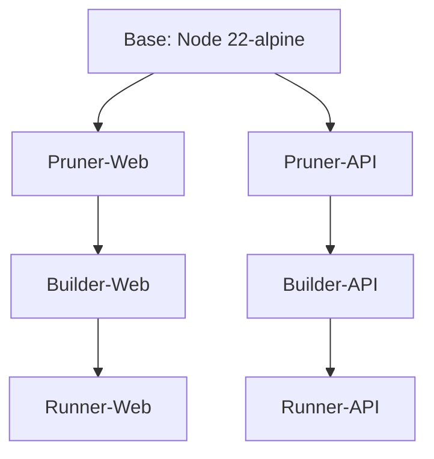

# Design: Dual-Stage Pruning Architecture

## Overview
We will refactor the `Dockerfile` to decouple the pruning logic for the Web and API applications.

## Architecture Diagram

## Changes
- **Dockerfile**:
    - Rename `pruner` to `pruner-web` and `@iter/web` target.
    - Create `pruner-api` with `api` target.
    - Path references in `COPY --from=...` will be updated to point to the specific pruner stage.

## Performance Impact
By separating the stages, Docker can cache the pruning of each app independently. If only the API code changes, the Web pruning and builder stages can be skipped entirely from cache.
