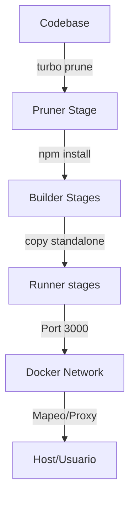

# Design: Estandarización y Optimización Docker

## Architecture Overview
La arquitectura de contenedores se basa en una imagen multi-etapa (`Dockerfile`) que utiliza Turbo Repo para el podado de dependencias. Se busca pasar de una configuración dispar a una homogénea donde cada servicio (Web y API) escuche en el mismo puerto interno (3000), facilitando la configuración de proxies y el descubrimiento de servicios.

## Technical Components

### 1. Dockerfile (Multi-stage)
- **Base Stage**: Se mantiene `node:22-alpine`.
- **Builder Stages**: Se optimizan para copiar solo los archivos necesarios antes del `npm install`.
- **Runner Stages**: 
  - Se añade `USER node` antes del `CMD`.
  - Se asegura que ambos `EXPOSE 3000`.
  - En la API, se asegura el copiado de archivos de Prisma necesarios para el runtime.

### 2. Docker Compose
- **docker-compose.yml**:
  - `web.ports`: Cambiar de `8002:3001` a `8002:3000`.
  - `api.ports`: Cambiar de `3000:3000` (mantener consistencia).
  - `setup.command`: Eliminar `--force-reset`.
  - **Healthchecks**: Añadir `test: ["CMD", "wget", "--no-verbose", "--tries=1", "--spider", "http://localhost:3000/health"]` (ajustar según endpoint real).

### 3. Application Config
- **Web (`apps/web/package.json`)**: Ajustar el script `dev` para usar el puerto 3000 por defecto.

## Data Flow

## Mapping & Ports
| Service | Internal Port | External Port (Dev) | User |
| --- | --- | --- | --- |
| API | 3000 | 3000 | node |
| Web | 3000 | 8002 | node |
| DB | 5432 | 5432 | postgres |
