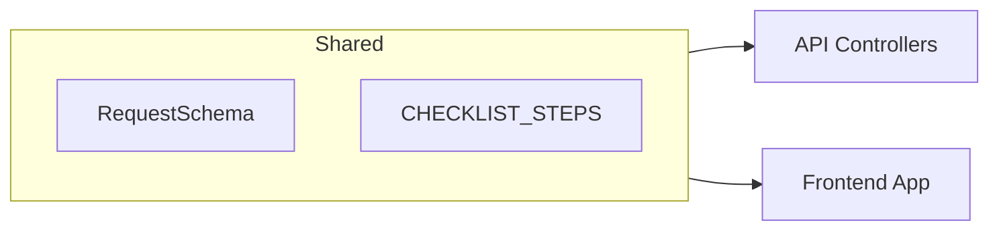

# Design: Fix Phase 1 & 2 Inconsistencies

## Technical Strategy
The fix involves standardizing field names in the shared library and ensuring the API logic correctly utilizes these standards. We will also introduce systematic logging for accountability.

## Proposed Changes

### 1. Shared Library Standardizations
We will update `shared/index.ts` to:
- Rename `approxStudents` to `studentsAprox` in `RequestSchema` and `RequestInput` type.
- Export a new constant `CHECKLIST_STEPS`:
  ```typescript
  export const CHECKLIST_STEPS = {
    DESIGNATE_TEACHERS: 'DESIGNATE_TEACHERS',
    NOMINAL_REGISTRATION: 'NOMINAL_REGISTRATION',
    CONFIRM_REGISTRATION: 'CONFIRM_REGISTRATION',
    PEDAGOGICAL_AGREEMENT: 'PEDAGOGICAL_AGREEMENT'
  } as const;
  ```

### 2. API Implementation
- **Request Controller**:
  - Update `createRequest` to handle `studentsAprox`.
  - Add `logStatusChange` helper call in `updateRequestStatus`.
- **Assignment Controller**:
  - Update `createAssignmentFromRequest` to use `CHECKLIST_STEPS` constants when creating the checklist.
  - Update `designateTeachers` to search for `CHECKLIST_STEPS.DESIGNATE_TEACHERS` instead of the hardcoded "Referent Teachers" substring.
  - Update `createEnrollments` to search for `CHECKLIST_STEPS.NOMINAL_REGISTRATION`.

### 3. Frontend (Web) Updates
- Perform a global search and replace of `approxStudents` with `studentsAprox` in:
  - `apps/web/services/assignmentService.ts`
  - `apps/web/app/[locale]/center/requests/page.tsx`
  - `apps/web/app/[locale]/requests/page.tsx`
  - `apps/web/app/[locale]/center/assignments/[id]/page.tsx`
  - `apps/web/app/[locale]/center/assignments/[id]/students/page.tsx`

---

## Architecture Visual

