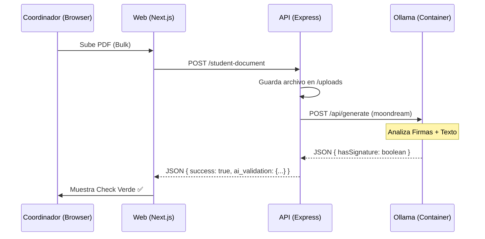

# Design: Local AI Documentation Validation

## Architecture

## Key Components

### 1. Vision Service (API)
- **Model**: `moondream` (Vision-enabled).
- **Communication**: REST API over local Docker network (`http://ollama:11434`).
- **Prompting**: Specialized instructions to detect "manuscript signatures" in the bottom third of the page.

### 2. Storage Fix (API)
- Use `process.cwd()` to ensure the `uploads/` folder is relative to the root of the API container.
- Implement an environment variable `UPLOAD_DIR` to allow volume mapping.

### 3. Frontend Refactor (Web)
- Remove `signatureDetector` class.
- The `BulkDocumentUpload` component will now handle the `POST` response from the API, which will include the AI validation results instead of performing them locally.
