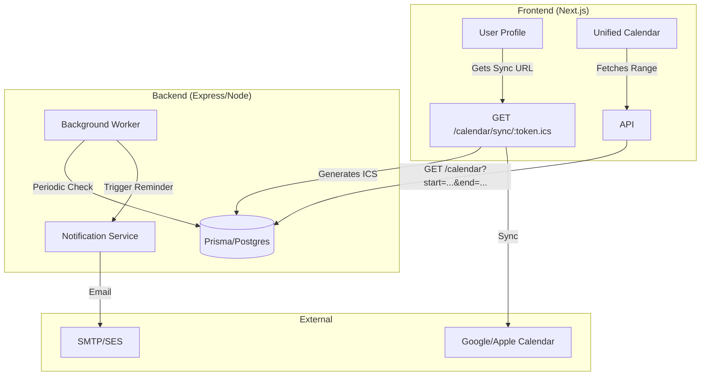

# Design: Improved Calendar System

## Architecture Overview

## Technical Decisions

### 1. Unified Calendar Component
*   **Library**: Refactor `apps/web/components/ui/Calendar.tsx` as the base, removing `apps/web/components/Calendar.tsx`.
*   **State**: Use `date-fns` for all calculations.
*   **Performance**: Memoize "tracks" calculation for event bars.

### 2. Notifications & Scheduling
*   **Queue/Scheduler**: Use `node-cron` for light-weight scheduled tasks within the API process.
*   **Storage**: Leverage the existing `Notification` model.
*   **Reminders**: Query `Session` and `CalendarEvent` daily and hourly to find upcoming overlaps with user assignments.

### 3. External Sync (iCal)
*   **Library**: Use `node-ical` or `ical-generator` to create valid `.ics` strings.
*   **Security**: Use a unique, non-guessable `syncToken` stored in the `User` model to allow public but secure access to the feed.

### 4. Database Schema Changes
*   `User`: Add `sync_token` (String, unique).
*   `Notification`: Potentially add `scheduled_for` (DateTime) if we want to pre-calculate reminders.

## UI/UX Design
*   **Themes**: Full compatibility with Light/Dark modes using `THEME` tokens.
*   **Event Bars**: Use high-contrast accessible colors defined in the theme.
*   **Feedback**: Skeleton loaders for range-based fetching.
