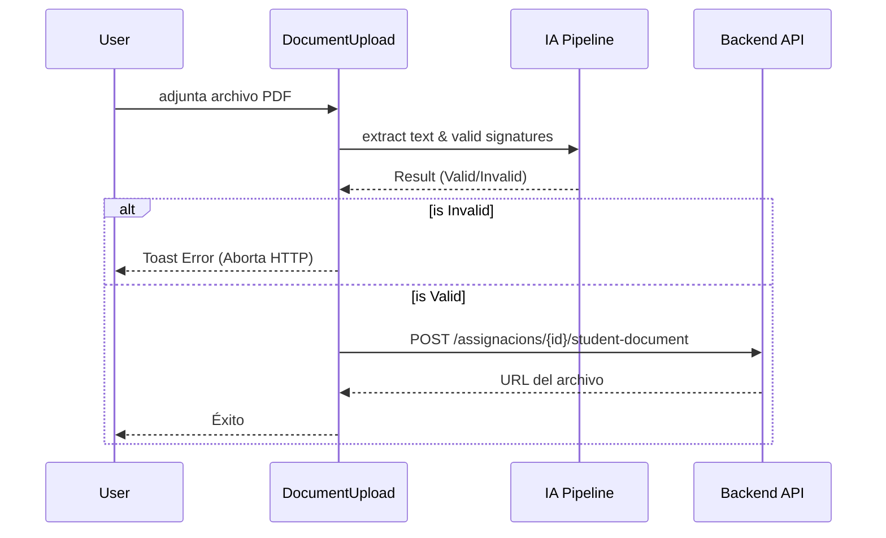

# Design: Integración del Validador IA en UI Existente

## Architecture Overview
Para mantener una buena experiencia de usuario (UX), no reemplazaremos la lista de alumnos por áreas "Dropzone" gigantes. En su lugar, el componente actual `DocumentUpload.tsx` importará las funciones expuestas en `lib/pdfUtils.ts` y `lib/visionUtils.ts` y las ejecutará dentro de su manejador `onChange` del *input* de archivos.

## Technical Components
1. **`apps/web/components/DocumentUpload.tsx`**:
   - Se introducirá un nuevo estado interno `validatingAI` (booleano).
   - En el método `handleFileChange`, *antes* de crear el `FormData` y lanzar la petición al backend, se ejecutará el pipeline.
   - **Pipeline Inyectado**:
     1. `extractTextFromPdf`
     2. `classifyDocumentType`
     3. Chequeo semántico: Si se esperaba "acord_pedagogic" pero el texto dice "drets_imatge", abortar.
     4. Si el tipo esperado es "acord_pedagogic": `signatureDetector.getBottomThirdOfLastPage` + `validateSignatures`.
   - Modificación visual de las etiquetas del botón: "ADJUNTAR" -> "VALIDANT (IA)..." -> "PUJANT..." -> "CANVIAR".

2. **Error Handling & Manual Bypass (Vía de Escape)**:
   - Dado que el modelo de Visión por Computador puede tener *Falsos Negativos* (ej. documento de mala calidad o iluminaciones raras haciendo que no se detecte la firma), si la IA rechaza el documento se mostrará un mensaje de alerta (usando `sonner`).
   - El botón cambiará visualmente para permitir un "Forzar Subida". Esto garantiza que el flujo administrativo no quede bloqueado permanentemente por un error de predicción del modelo. El usuario deberá confirmar expresamente que las firmas existen para saltarse la validación de la IA.

## Data Flow

