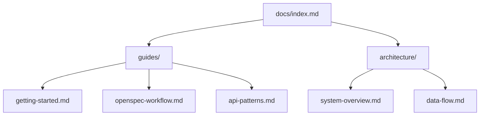
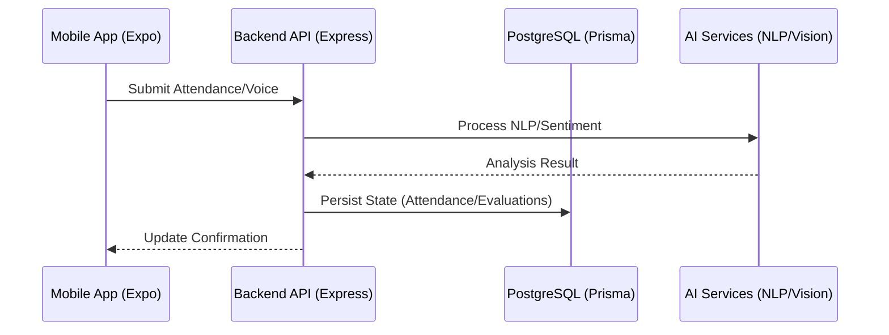

# Design: Professional Documentation Architecture

The documentation will be structured to provide a logical flow from "How to Start" to "How the System Works Internally".

## 1. Documentation Structure

## 2. Visual Enhancements (Mermaid)

### Data Lifecycle Diagram
This diagram will be added to `docs/architecture/data-flow.md` to explain the interaction between components:

## 3. Implementation Details

- **Navigation**: The `index.md` will use callouts and grouped links for better scanability.
- **Tone**: Professional, using active voice and clear technical terminology.
- **Diagrams**: Mermaid.js for all architecture and workflow visualizations.
