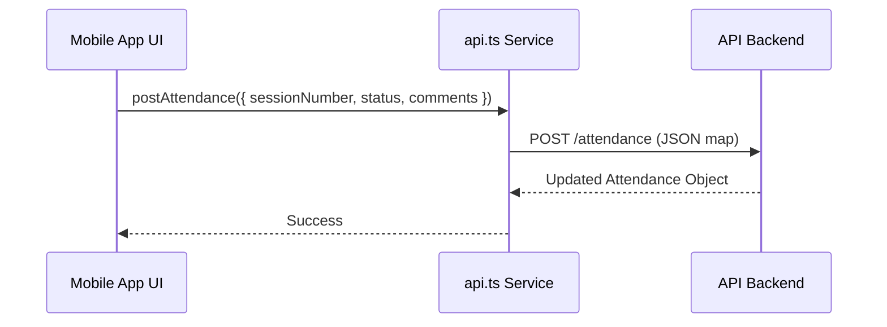

# Design: Refactorización API Móvil (Nomenclatura en Inglés)

## Architecture Overview
La arquitectura de la aplicación móvil se mantendrá mayoritariamente igual, pero se desacoplarán las interfaces de datos (`Assignment`, `Enrollment`) de la dependencia directa de `@iter/shared` (que proviene de Prisma) si es necesario para permitir una migración gradual o específica de la móvil. Se optará por actualizar los tipos en `apps/mobile/services/api.ts` para que reflejen la realidad de la nueva API.

## Technical Components

1. **`apps/mobile/services/api.ts`**:
   - **Tipos de Parámetros**: Se modificarán las firmas de las funciones para usar `sessionNumber`, `status` y `comments`.
   - **Interfaces Locales**: Se definirán interfaces locales para `Assignment` y `Enrollment` (o se actualizarán los *type aliases*) para asegurar que `startDate` y `surnames` sean los campos estándar.

2. **Componentes de React Native (`apps/mobile/app/`)**:
   - **Dashboard**: Se actualizará la lógica de visualización que depende de `data_inici` para usar `startDate`.
   - **Sesión de Clase**: Se actualizará la gestión de la lista de alumnos (`cognoms` -> `surnames`) y el envío de asistencia (`numero_sessio` -> `sessionNumber`, etc.).

## Data Flow

## Mapping Table
| Catalan (Old) | English (New) | Model |
| --- | --- | --- |
| `numero_sessio` | `sessionNumber` | Attendance |
| `estat` | `status` | Attendance |
| `observacions` | `comments` | Attendance |
| `data_inici` | `startDate` | Assignment |
| `cognoms` | `surnames` | Student / Enrollment |
