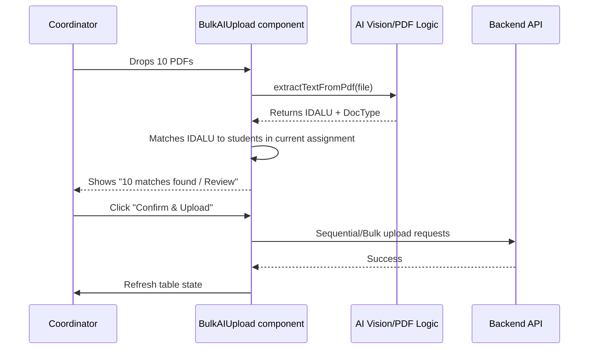

# Design: Phase 2 AI-Unified Console

## Data Flow & UI Logic

## UI Components
- **`Phase2Console`**: Main container in `assignments/[id]/page.tsx`.
- **`Phase2Table`**: Compact table view for students and their 3 document slots.
- **`StudentSelectionDrawer`**: Replaces the full-page register.
- **`BulkAIUpload`**: The dropzone containing the logic from `DocumentUpload.tsx` but expanded for multiple files.

## Admin Enhancements
- **AI Confidence Badges**: UI indicator (`badge`) showing the result of `visionUtils` or `pdfUtils`.
- **Bulk Action Bar**: Floating bar on multiple selection in the Admin Verification table.
