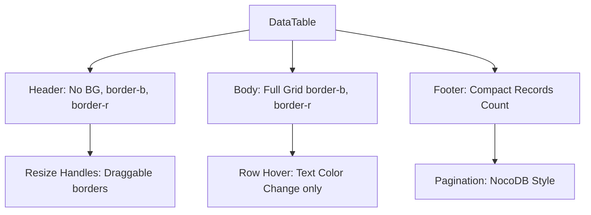

## Design: NocoDB-Style "Raw Grid"

This design implements a high-density, minimalist data grid for the web application.

### Visual Architecture



### Technical Decisions

#### 1. High-Density Layout
- **Font Size**: Change from `text-sm` (14px) to `text-[12px]`.
- **Padding**: Uniform `p-1.5` (6px) or `p-2` (8px), aligning with NocoDB's density.
- **Grid Lines**: Apply `border-r border-b border-border-subtle` to all `th` and `td`. This creates a perfect spreadsheet-like grid.

#### 2. Background-Free Aesthetics
- Remove all semantic background tokens from `DataTable` and `FilterPanel`.
- **Headers**: Transparent/white with a bottom border.
- **Alternating Rows**: Remove `even:bg`. Use pure white/transparent backgrounds.
- **Buttons**: Action buttons (Edit, Delete, Export) will lose their "Pill" background. Feedback will be provided via `text color` transitions (e.g., icons turning `consorci-darkBlue` on hover).

#### 3. Column Resizing Engine
- **State**: A new `widths` object state in `DataTable` mapped by column `key` or `index`.
- **Persistence**: Synchronization with `localStorage` based on a unique `tableId` prop.
- **UI**: A hidden `resizable-handle` absolute positioned div on the right border of each `th`.

#### 4. FilterPanel Unification
- The `FilterPanel` will lose its own `bg-background-surface` and padding.
- It will align its inputs to the table columns grid to create a single "Data Island" effect.

### Interface Mockup (ASCII)

```text
┌───────────────────────────────────────────────────────────┐
│ [ Search ] [ Status ]                       [ Actions  ]  │ (FilterPanel: Minimalist)
├───────┬───────────────┬─────────────────┬─────────────────┤
│ #     │ Teacher       │ Enrollment      │ Action          │ (DataTable: Responsive/Dense)
├───────┼───────────────┼─────────────────┼─────────────────┤
│ 1     │ J. Domènech   │ 24              │ [Edit] [Del]    │
├───────┼───────────────┼─────────────────┼─────────────────┤
│ 2     │ M. Puig       │ 18              │ [Edit] [Del]    │
└───────┴───────────────┴─────────────────┴─────────────────┘
                                   1-50 of 1204 Records < 1 > 
```

### Data Flow
1. User drags a column handle.
2. `onMouseMove` updates the `widths` state.
3. `onMouseUp` persists the new configuration to `localStorage[tableId]`.
4. Page reload: `useEffect` initializes `widths` from `localStorage`.
