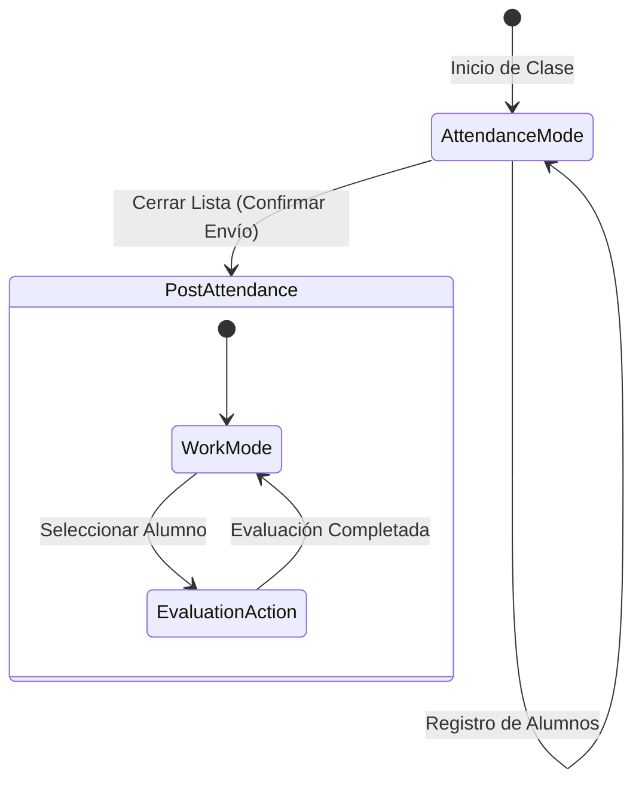

# Diseño Técnico: Rediseño UX Mobile - Asistencia y Gestión de Sesiones

## Visión de la Interfaz
El rediseño se basa en el principio de **Jerarquía de Intención**. La pantalla de sesión ya no será una lista estática, sino una interfaz reactiva que guía al profesor.

## 1. Flujo de Estados (Split Moments)

Utilizaremos un estado local para controlar el "momento" de la sesión:



- **Modo Asistencia**: Foco exclusivo en quién ha venido. Tarjetas grandes con selectores claros.
- **Modo Trabajo/Evaluación**: Lista filtrada o marcada visualmente. Las tarjetas ahora exponen el botón "Evaluar Competencias".

## 2. Rediseño de Componentes

### Tarjeta de Alumno (Attendance Mode)
Sustitución del toggle cíclico por un **Segmented Control** (Chips):

```
┌──────────────────────────────────────────────┐
│  [Avatar]  NOMBRE DEL ALUMNO        [ID: ...]│
├──────────────────────────────────────────────┤
│  ┌───────────┐  ┌───────────┐  ┌───────────┐ │
│  │ PRESENT (V)│  │ AUSENTE (X)│  │ TARDE (L) │ │
│  └───────────┘  └───────────┘  └───────────┘ │
└──────────────────────────────────────────────┘
```

- **Estética**: Bordes redondeados (`rounded-3xl`), sombras suaves (`shadow-sm`), y mayor `padding-vertical` para dar "aire".
- **Interacción**: Al pulsar un estado, la tarjeta cambia ligeramente de opacidad o color de fondo para confirmar visualmente la acción.

### Transición de Paz Mental
Cuando el profesor pulsa "Finalizar y Enviar Asistencia":
1. Se muestra una animación de éxito (Checkmark gigante).
2. La lista se reordena: Alumnos presentes arriba, ausentes (opcionalmente) se colapsan o se van al final.
3. El título cambia de "Pasar Lista" a "Gestión de Sesión / Evaluación".

## 3. Arquitectura de Código

### Estado de Asistencia
Centralizaremos el estado en un hook personalizado para manejar la lógica de "batch" y las transiciones de modo.

### Estilizado (Tailwind/NativeWind)
- Uso de `THEME.semantics.light.background.page` para el fondo.
- Uso de `THEME.primitives.neutral[50]` para superficies secundarias.
- Espaciado: Incrementar el `mb-3` actual a `mb-5` para mejorar el scroll.

## 4. Accesibilidad y UX
- **Affordance**: El Segmented Control hace obvias las opciones disponibles.
- **Feedback Háptico**: Vibración ligera al cambiar el estado de un alumno.
- **Micro-interacciones**: Scroll suave al pulsar el botón de finalizar.
