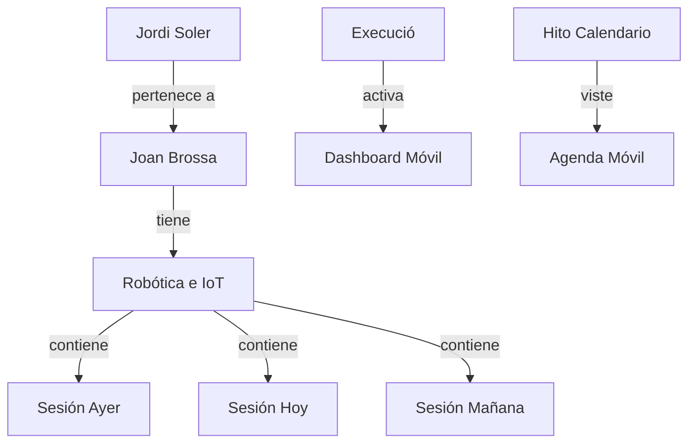

# Design: Sincronización de Calendario con Datos Reales

Este documento detalla la implementación técnica necesaria para transformar el entorno de desarrollo móvil de "mock-based" a "data-driven".

## Cambios en el Backend (Seeder)

### 1. Reajuste de Fases
En `seed.ts`, la variable `isActive` se asignará a `PHASES.EXECUTION` en lugar de `PHASES.APPLICATION`.

### 2. Generación de Datos Operativos (Assignments & Sessions)
Se creará una nueva función `seedOperativeData()` que realice lo siguiente:
- **Assignment**: Crear un `Assignment` para el Centro "Joan Brossa" y el taller "Robótica e IoT".
- **Sessions**: Crear 3 sesiones para dicho `Assignment` en fechas cercanas (ayer, hoy y mañana) para verificar el filtrado por fecha del calendario.
- **Staffing**: Vincular a `Jordi Soler` y `Laura Martínez` como profesores de estas sesiones.
- **Milestones**: Añadir 2 `CalendarEvent` marcando el "Inici de Tallers" y "Reunió de Seguiment" en fechas relevantes.

## Cambios en la App Móvil (API Service)

### 1. Limpieza de Interceptores
En `apps/mobile/services/api.ts`:
- Se eliminarán los bloques de código que interceptan respuestas de `/calendar`, `/phases` y `/assignments` cuando el servidor falla o el usuario es "conocido".
- Se mantendrá el sistema de detección automática de IP para asegurar la conectividad con el backend local.

## Esquema de Datos Final

