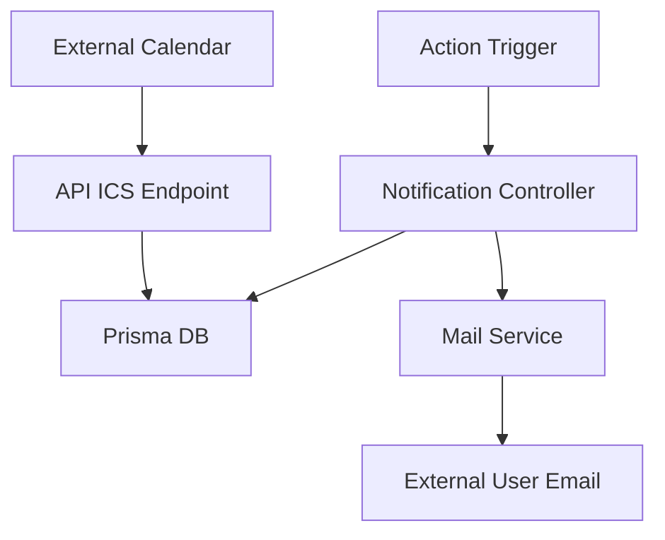

# Design: Notification Sync & Email Notifications

## Architecture

The system will be expanded with a `MailService` and a new ICS endpoint for notifications.

### 1. Data Model Updates
- **Table**: `User`
- **New Field**: `emailNotificationsEnabled` (Boolean, default: true)
- **New Field**: `emailNotificationsFilter` (Json, optional, for filtering by type)

### 2. Backend Logic
- **MailService**: A new utility/service using `nodemailer` to handle SMTP delivery. It will read SMTP settings from environment variables.
- **Notification Trigger**: The `createNotificationInternal` function in `notification.controller.ts` will be updated to:
    1. Create the database record.
    2. Check if the recipient user has `emailNotificationsEnabled`.
    3. If yes, call `MailService.sendNotificationEmail`.
- **ICS Generation**: A new endpoint `GET /api/notifications/ics/:token` will:
    1. Validate the user by `syncToken`.
    2. Fetch recent notifications.
    3. Map them to `ICSEvent` objects (Start date = `createdAt`).
    4. Return the generated ICS.

### 3. Frontend Integration
- **Profile Page**: Add a toggle in the settings section.
- **Sync Modal**: Update the `SyncCalendarModal` component to include a section for "Sincronizar Avisos" with its own URL.

## Integration Points

## Environment Variables
- `SMTP_HOST`
- `SMTP_PORT`
- `SMTP_USER`
- `SMTP_PASS`
- `MAIL_FROM`
